# Exposed: "WasteAc" skidding, 圈钱, 倒打一耙
前情提要: `NeoAntiCheat` 与 `WasteAc` 无直接关系, 也并未合作过。
以下截图均来自`Github`, `QQ聊天记录`, `强烈谴责NeoAntiCheat开发者！破解他人插件公之于众！.docx`

我不认识你。
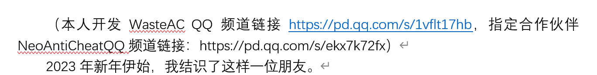

## Skidding "WAntiCheatPro"
### 角度计算
`WAC Pro`

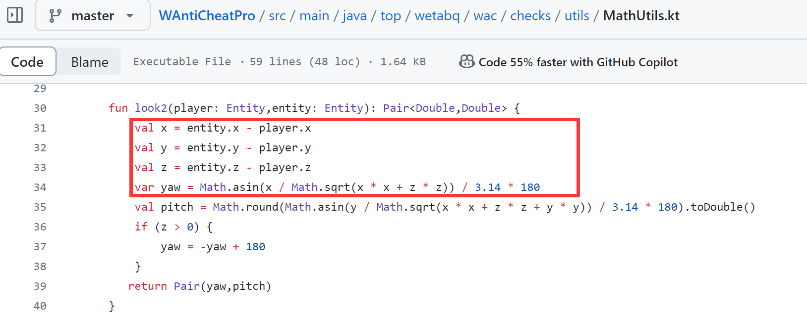

`WasteAc`

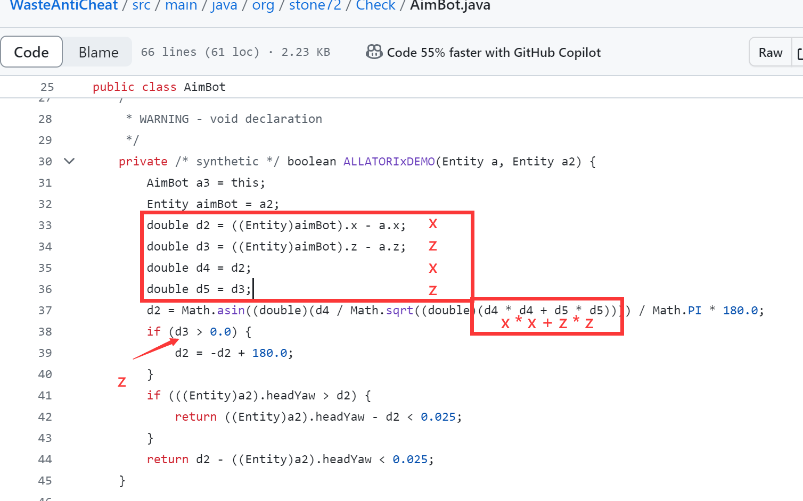
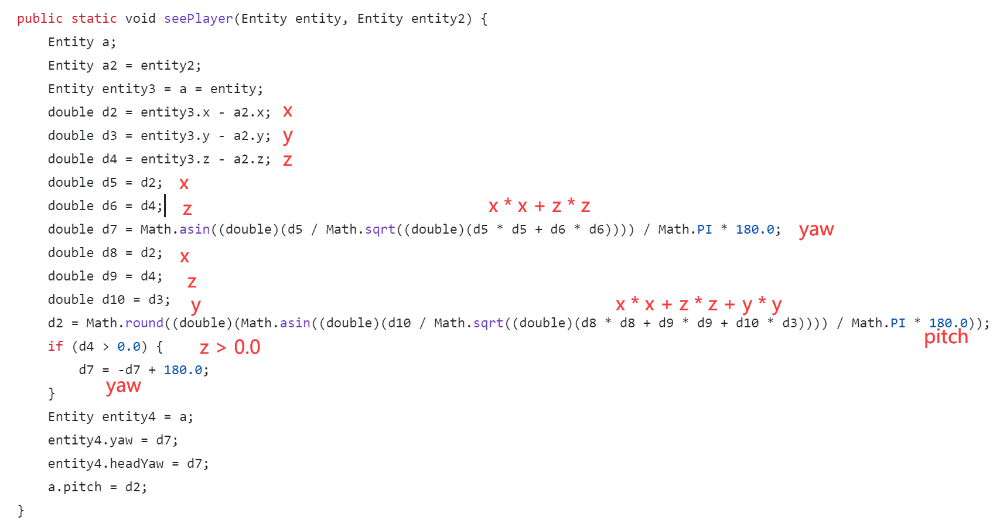

为什么两处代码高度吻合?
为什么其中一位开发者正好Star了`WAC Pro`?

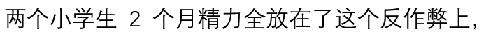

既然两位开发者都是小学生在读，那么在上述代码中出现了`Math.asin`和`sqrt`，还乘以了`180`。这一定是两位奥数天才在小学就学习了反正弦函数，弧度制，平方根吧。

希望未来能在数竞的舞台上看到你们的身影。

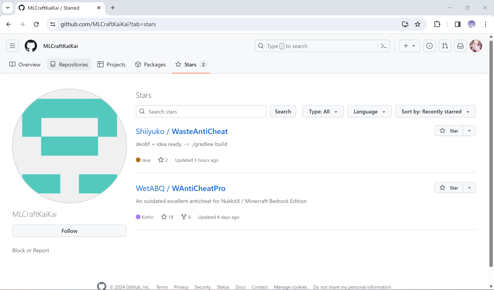

为什么在只看`README`的情况下使用意念思考出了如从相似的代码?
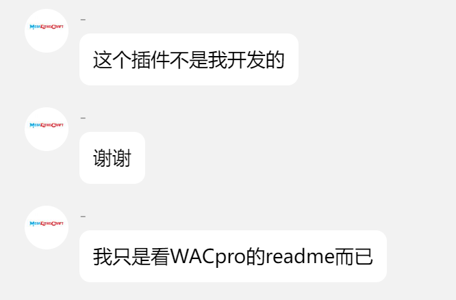

### NPC 假人
#### Gravity
`WAC Pro`
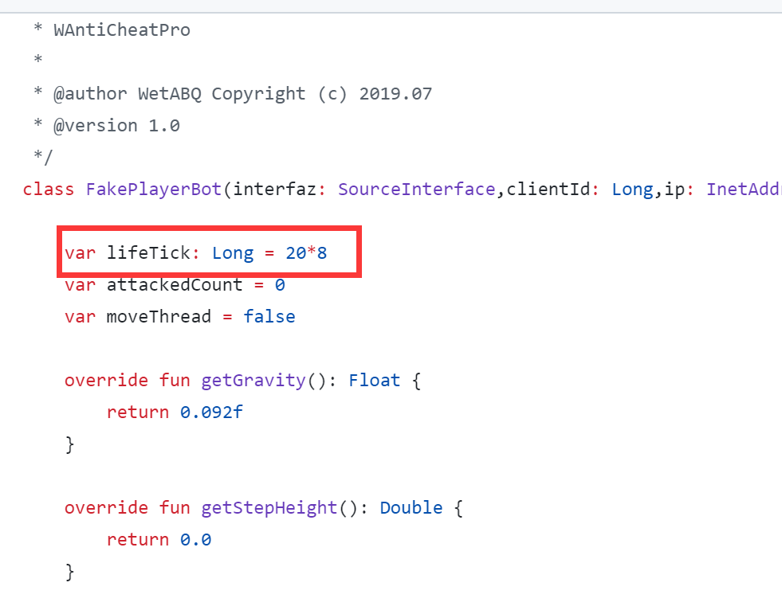
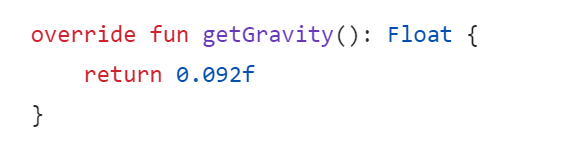

`WasteAc`

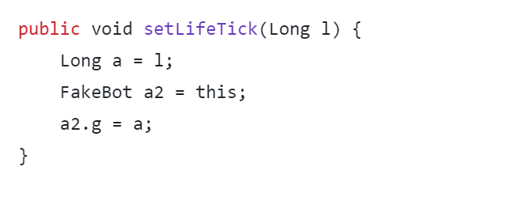
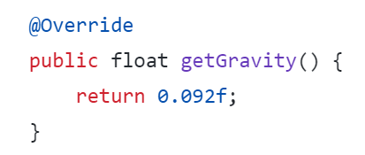

这位开发者，如果你不知道`20 * 8 = 160`的话，可以按照如下步骤计算:
1. 将 `20 * 8` 改写为 `2 * 8 * 10`
2. 从**九九乘法表**可知，`2 * 8 = 16`
3. 因此 `16 * 10 = 160`

既然没有打滑`WAC Pro`，为何可以在源码中找到的`0.092f`与`WAC Pro`**完全一致**?
为什么`lifeTick`变量名与`WAC Pro`**完全一致**?
而在`Nukkit`中的`cn.nukkit.entity.Entity`类中，该值为`0f`
#### StepHeight
`WAC Pro`
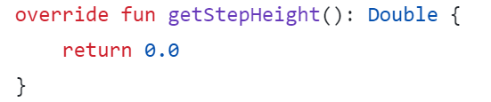

`WasteAc`
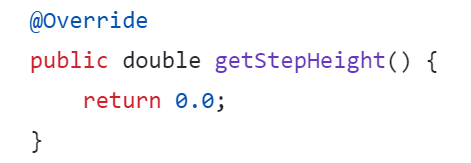

在`Nukkit`中的`cn.nukkit.entity.EntityHuman`类中，该值为`0.6f`
而`WasteAc`继承了`EntityHuman`并重写了该方法，重写为`0.0f`


综上所述，我想这一定是一个**巧合**，而不是**打滑**。

## 圈钱
### 前情提要

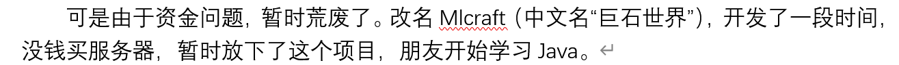
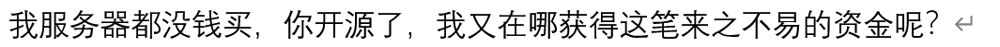
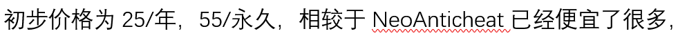

在`WasteAc`起步阶段，甚至没有钱去部署验证服务器和测试服务器

但没有任何经济能力的**小学生**开发者却给出了

`订阅反作弊之后，我们会对您提供售后服务的，完全不会出现拿钱跑路的现象！`

的承诺。

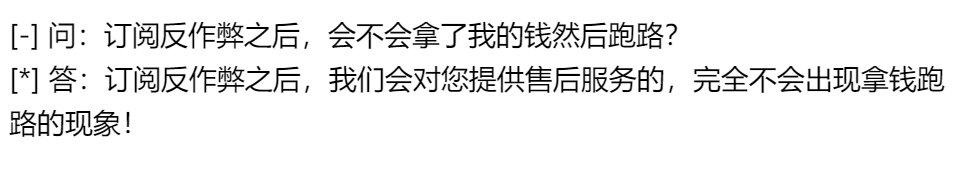

### 倒闭跑路

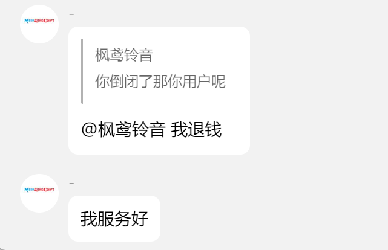

在`前情提要`中，可以看出来两位开发者是囊中羞涩，赚来的钱会投入到服务器当中。

**假如**倒闭跑路，没有任何经济能力的小学生开发者是否能拿得出这一笔"巨款"，补偿给用户呢?

### 高质量代码
```java
    @EventHandler
    public void onAttack(EntityDamageByEntityEvent entityDamageByEntityEvent) {
        EntityDamageByEntityEvent a = entityDamageByEntityEvent;
        KillAura a2 = this;
        if (a.getDamager() instanceof Player && a.getEntity() instanceof Player) {
            Player player = (Player)a.getDamager();
            Player player2 = (Player)a.getEntity();
            if (Config.getCheck$enable().contains((Object)"KillAura") && !Config.getSetting$excluded_worlds().contains((Object)player.getLevel().getName())) {
                boolean bl = false;
                if ((Integer)g.getOrDefault((Object)player.getName(), (Integer) 0) != 0) {
                    if (Server.getInstance().getTick() - (Integer)g.get((Object)player.getName()) < Config.getCheck$KillAura$min_attack_delay()) {
                        if (ALLATORIxDEMO.containsKey((Object)player.getName()) && !((String)ALLATORIxDEMO.get((Object)player.getName())).equals((Object)player2.getName())) {
                            bl = true;
                        }
                    } else if (Server.getInstance().getTick() - (Integer)g.get((Object)player.getName()) >= 20) {
                        ALLATORIxDEMO.remove((Object)player.getName());
                    }
                }
                g.put((String) player.getName(), (Integer) Server.getInstance().getTick());
                ALLATORIxDEMO.put((String) player.getName(), (String) player2.getName());
                Method.spawnBot(player);
                if (playerBot.containsKey((Object)player.getName()) && !a.isCancelled()) {
                    ((FakeBot)((Object)playerBot.get((Object)player.getName()))).setLifeTick(((FakeBot)((Object)playerBot.get((Object)player.getName()))).getLifeTick() + 20L);
                }
                if (bl) {
                    if (!player.isOp() && !Config.isSetting$debug()) {
                        WasteAC.PlusVl(player.getName(), "KillAura");
                    }
                    if (Config.isSetting$debug()) {
                        Method.sendDebug((Player)a.getDamager(), "KillAura", new StringBuilder().insert(0, "tick-").append(g.get((Object)player.getName())).toString(), "The player attack 2 or more players in an instant, similar to KillAura or AimBot or HitBox");
                    }
                }
            }
        }
        if (a.getDamager() instanceof Player && a.getEntity() instanceof FakeBot) {
            EntityDamageByEntityEvent killAura = a;
            EntityDamageByEntityEvent killAura2 = a;
            killAura2.setDamage(0.0f);
            killAura2.setKnockBack(0.0f);
            killAura.setAttackCooldown(0);
            killAura.setCancelled(false);
            if (Config.getCheck$enable().contains((Object)"KillAura") && !Config.getSetting$excluded_worlds().contains((Object)a.getDamager().getLevel().getName())) {
                attackBot.put((String) a.getDamager().getName(), (Integer) ((Integer)attackBot.getOrDefault((Object)a.getDamager().getName(), (Integer) 0) + 1));
                ((FakeBot)a.getEntity()).setLifeTick(((FakeBot)a.getEntity()).getLifeTick() + 20L);
                if ((Integer)attackBot.get((Object)a.getDamager().getName()) > Config.getCheck$KillAura$max_attack_bot()) {
                    if (!((Player)a.getDamager()).isOp() && !Config.isSetting$debug()) {
                        WasteAC.PlusVl(a.getDamager().getName(), "KillAura");
                    }
                    if (Config.isSetting$debug()) {
                        Method.sendDebug((Player)a.getDamager(), "KillAura", new StringBuilder().insert(0, "attackBot-").append(attackBot.get((Object)a.getDamager().getName())).toString(), "When the player attacks, he repeatedly attack the bot, which may be KillAura");
                    }
                }
            }
        }
    }
```

节选自`org/stone72/Check/KillAura.java`。

即使代码经过简单的混淆，我们不难看出代码中包含了大量的`if-else`语句嵌套。这会导致方法复杂度直线上升，很难想象在后期的维护当中，是否能够读懂自己的代码?

其次，在每项检测都实现了`Listener`，作为事件监听。声明了几个`Map`用于储存数据：
```java
    private static final Map<String, Integer> g;
    public static final Map<String, Integer> attackBot;
    private static final Map<String, String> ALLATORIxDEMO;
    public static final Map<String, FakeBot> playerBot;
```
节选自`org/stone72/Check/KillAura.java`。

我们通过简单的分析(`a.getDamager().getName()`)可以得知，`Map`中的`key`为玩家名称。这种储存方法并没有什么问题。但是该对象被`static`和`final`修饰，这说明`Java`的`GC`无法对该对象进行回收。

而在所有代码中，我们并未发现有`map.remove`的调用。尽管不被`static`和`final`修饰，但是即使不再显式使用该对象，`GC`也不会回收`Map`中的键值对。

以上情况均说明`WasteAc`会导致服务器内存泄漏。这种低级问题不应该出现在编码中。

在项目之后的开发中，开发者是否能够良好维护，并且会不会因为低级问题导致的异常而跑路？


## 倒打一耙

从`##圈钱 - ### 高质量代码`中可以得知，对方开发者的水平令人堪忧。

而这位开发者对`NeoAntiCheat`给出了高度赞誉：
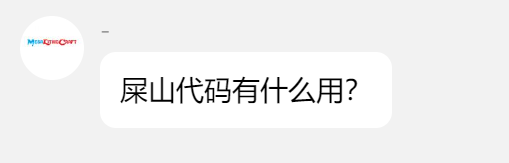
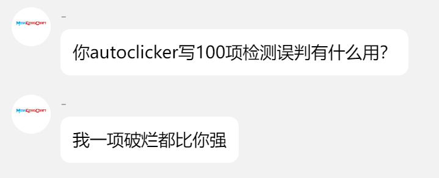

让我们看看`WasteAc`是如何实现`AutoClicker`检测的：
```java
    @EventHandler
    public void onAttack(EntityDamageByEntityEvent entityDamageByEntityEvent) {
        EntityDamageByEntityEvent a = entityDamageByEntityEvent;
        AutoClicker a2 = this;
        if (a.getDamager() instanceof Player && Config.getCheck$enable().contains((Object)"AutoClicker") && !Config.getSetting$excluded_worlds().contains((Object)a.getDamager().getLevel().getName())) {
            a.setCancelled(true);
            if (Server.getInstance().getTick() - (Integer)ALLATORIxDEMO.getOrDefault((Object)a.getDamager().getName(), (Integer) 0) >= 20) {
                cpsMap.put((String) a.getDamager().getName(), (Integer) 0);
                ALLATORIxDEMO.put((String) a.getDamager().getName(), (Integer) Server.getInstance().getTick());
            }
            cpsMap.put((String) a.getDamager().getName(), (Integer) ((Integer)cpsMap.getOrDefault((Object)a.getDamager().getName(), (Integer) 0) + 1));
            if (Server.getInstance().getTick() - (Integer)g.getOrDefault((Object)a.getDamager().getName(), (Integer) 0) >= a.getAttackCooldown()) {
                a.setCancelled(false);
                g.put((String) a.getDamager().getName(), (Integer) Server.getInstance().getTick());
            }
            a.setAttackCooldown(0);
            if ((Integer)cpsMap.getOrDefault((Object)a.getDamager().getName(), (Integer) 0) > Config.getCheck$AutoClicker$max_cps()) {
                if (!((Player)a.getDamager()).isOp() && !Config.isSetting$debug()) {
                    WasteAC.PlusVl(a.getDamager().getName(), "AutoClicker");
                }
                if (Config.isSetting$debug()) {
                    Method.sendDebug((Player)a.getDamager(), "AutoClicker", new StringBuilder().insert(0, " cps-").append(cpsMap.getOrDefault((Object)a.getDamager().getName(), (Integer) 0)).toString(), "The player clicked too quickly during the attack, which may be due to AutoClicker");
                }
            }
        }
    }
```
节选自`org/stone72/Check/AutoClicker.java`。

从上面的代码中不难看出，`WasteAc`只是简单的判断了玩家的CPS是否高于阈值。

而开发者只用这种简单的算法就否定了使用峰度，偏态系数，离群，抖动分析算法实现的`AutoClicker`。属实是令人忍俊不禁。

### 奇异搞笑
``` PlainText
NAC为什么要将其他反作弊源码开源？
在那研究如何把别的反作弊插件破解，吸引眼球，
就可以把自己的NAC“autoClicker误判，Speed误判，
HighJump没有，NoClip穿墙没有，BHop有时误判”掩盖掉？
```

`AutoClicker`, `Speed`误判指的是在**Badcase**中出现的少量(1~3)个标记。

不同于`Java Edition`，基岩版的通讯使用`UDP`，这是不可靠的传输协议，因此，在部分情况下**Badcase**无法避免。

而反作弊拥有`Violation Level`系统，该系统旨为减少错误判定，而最终判定是惩罚。如果常规的操作出现了大量的标记，可以视作误判。而在**Badcase**中仅仅出现少量标记，该标记会随着正常游玩自然衰减。

若对方将**Badcase**中出现的部分标记视作"误判"，那么对方的反作弊是否会有更多"误判"?

这种行为可能源自于自卑感或者试图在群体中获得优势感。

反观`WasteAc`，则出现了`106 BPS Vanilla Fly`和`10 BPS Bhop`的绕过，令人忍俊不禁。

对于部分检测项没有实现的回复：
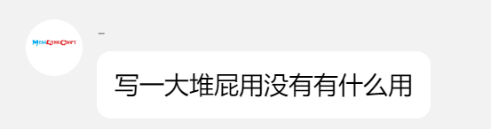
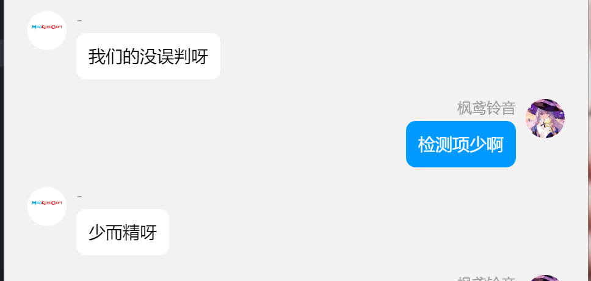
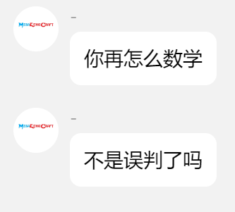


## 行为艺术
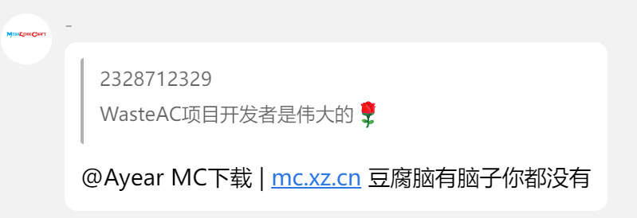
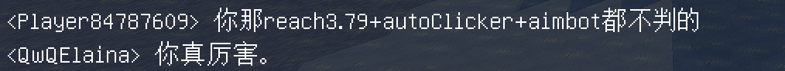

## 艺术殿堂
### 优雅检测
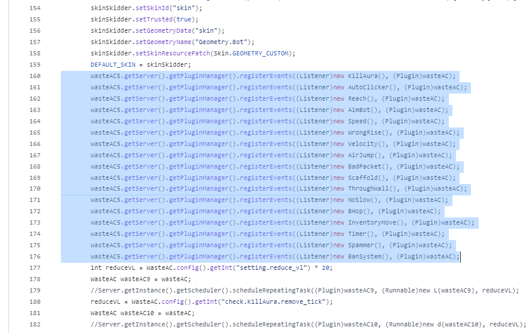

### 优雅指令
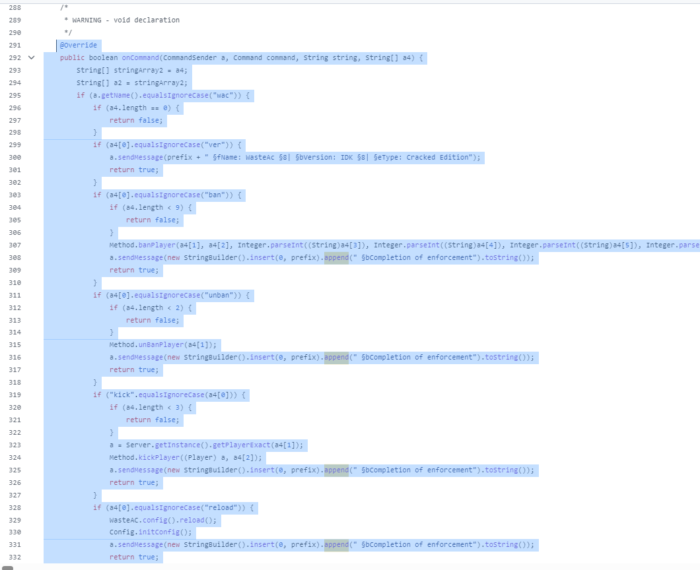


### 优雅验证
```java
    public static boolean checkBuy() {
    try (Socket socket = new Socket("127.0.0.1", org.stone72.Utils.Config.getSetting$port());
         PrintWriter out = new PrintWriter(socket.getOutputStream(), true);
         BufferedReader in = new BufferedReader(new InputStreamReader(socket.getInputStream()))) {
        
        out.println("GET_TIME=" + getHWID());
        String response = in.readLine();
        
        if (response.equals("infinite") || response.equals("error")) {
            return response.equals("infinite");
        }
        
        stopTime = response;
        return Method.getCalendar2().getTimeInMillis() < Method.parseDateString2(response).getTimeInMillis();
        
    } catch (IOException e) {
        e.printStackTrace();
        plugin.getLogger().info("§e无法连接到验证服务器");
        Server.getInstance().shutdown();
        return false;
    }

    plugin.getLogger().info("§e验证失败,请持续订阅WasteAC后再使用");
    Server.getInstance().shutdown();
    return false;
}

```

验证部分代码并非来自`WasteAc`，照着字节码写的。混了控制流。

原流程图：
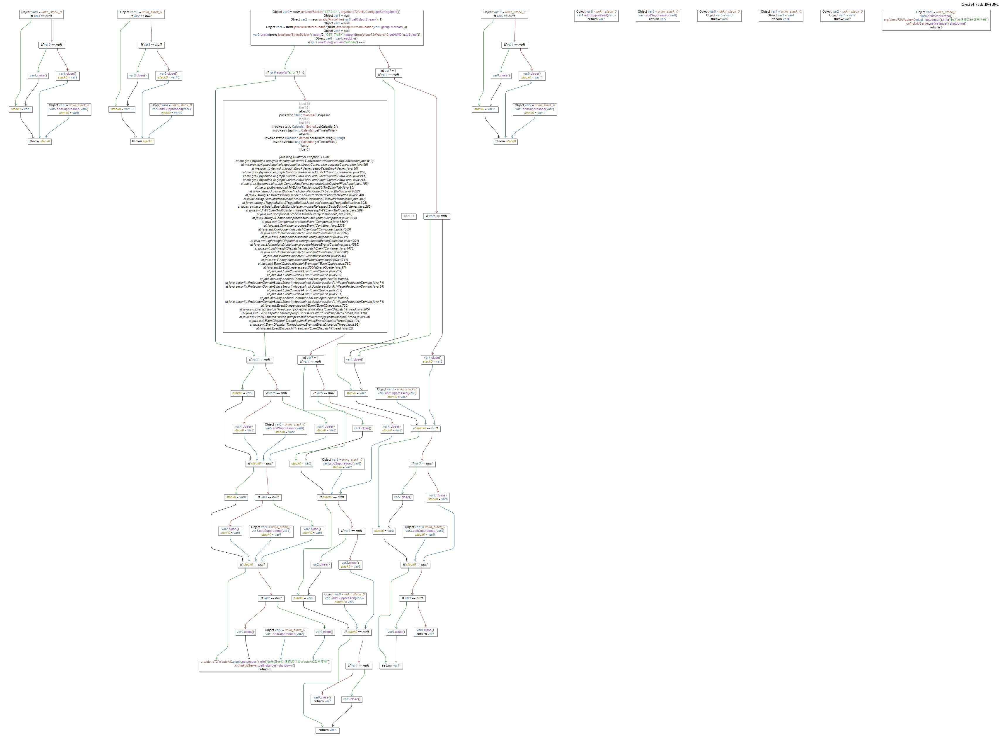

### 优雅二创


### 优雅文学

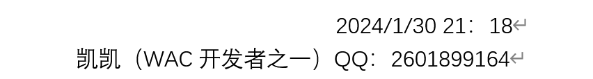

### 优雅英语


## 文学创作
纯属虚构，不要自我代入。

### 九年反作弊
我写了我的世界反作弊9年了，我们实例的差距隔开了一整个反作弊圈你知道吗，抱歉你真的太装了，我忍不住才说的这些，不是我们waste ac没有素质，只是你的ne0 ac太装了懂了吗，你这反作弊明显偷看了我们最强wasteac的源码，知道吗，你就是我们watseav的手下败将，明天我就会发布你反作弊的误判视频让你丢人知道吗？你会知道天差地别的反作弊，你这种烂大街的东西不能和我们watseac相提并论的，为了挑衅我们的最强反作弊，你真是煞费苦心，你为什么不敢直接去qq上对我喊话啊，哈哈哈哈。

### 最强反作弊
我的个人观点就是我想跟你的ne0ac比一下，为了公平去见我会邀请我的好朋友小明在旁边观战，我还会让小明录制视频发到yoututube上面哈哈哈哈，光想想就知道你会输了，你别投降，这样我们wasteac会很没面子，我们反作弊获胜的台词都想好了哈哈哈，出去别说我们最强反作弊欺负你，只是为了教训你个狂妄自大的小子哈哈哈，让你知道什么叫做我的世界最强反作弊哈哈哈哈。

### skid大神
主播很明显，你autoclick有误判了，虽然我找不到是什么，但是别人开autoclick报出autoclicka的已经暴露了你的反作弊缺点，我甚至一眼就能看出来你skid的是什么反作弊，因为我用过你的同款反作弊，没记错的话这是n,oe ac吧，我知道的，大腐竹都在使用的反外g，很多服的反作弊就是菜，想要变强就会使用你的反作弊，你没错，但是你泄露并开源我们的最强wastea反作弊就是你的不对了，你写的没有我厉害，挂鱼停的扶住写的甚至都比你好

### 神速开源
是的，我发现你的killaura检测用的很熟练，这使你几乎是没有误判的，你的autoclick检测也很好，并且善用ai学习；不仅如此，你的搭路检测已经写得出神入化了，但是综合检测还是离我们wasteaAc差了点；我发现你貌似是neoac玩家，你修复bug和泄露源码的时候快得惊人，支持主播，加油

### 至尊虚荣心
泄露开源这种行为是不对的！你们不就是为了虚荣心吗，就是想高人一等，就是体验虐人的快乐，快乐终究是一时，你们这样永远不会得到真正的快乐的，而且你们这种快乐是建立在别人的痛苦之上的！
                                               -wa ste ac

### 必须关闭
你们这些horiondev的太可恶了，前几天。我家孩子，2年级，8岁，写了一个叫。was,te的反作弊，他写了一个叫。w,r ongrise的功能，然后怎么写都被绕过，然后昨天下午，你们公开了它的源码，他从13楼跳下去，以为就可以跑路了，全身断裂了。你们这些horiondev的太可恶了，必须关掉源码。

## 相关资源
WasteAc Source: [Github](https://github.com/Shiiyuko/WasteAntiCheat)

WasteAc Jar(未破解，原Jar): [Download](./stuff/WasteAC.jar)

强烈谴责NeoAntiCheat开发者: [Download](./stuff/强烈谴责NeoAntiCheat开发者.docx)

106 bps vanilla fly: [Download](./stuff/fly.mp4)

10 bps Bhop: [Download](./stuff/bhop.mp4)
